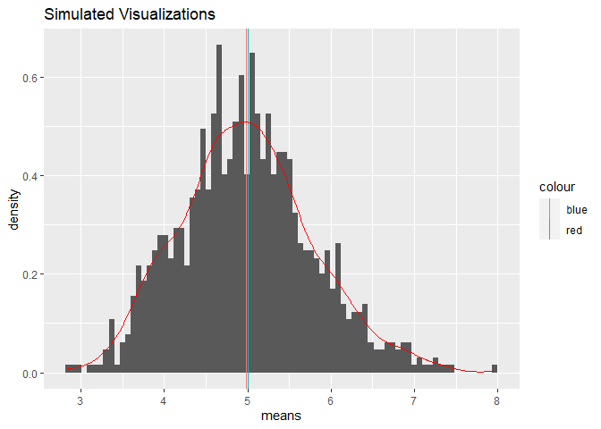
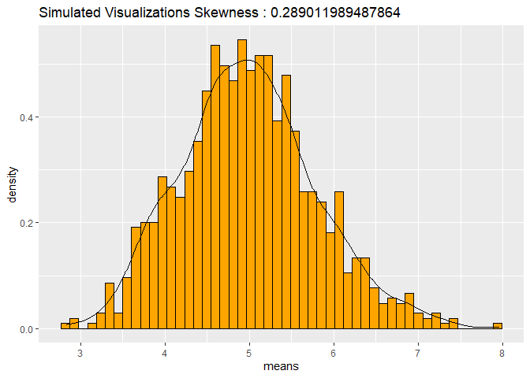

Illustrate via simulation and associated explanatory text the properties
of the distribution of the mean of 40 exponentials. You should

1.  Show the sample mean and compare it to the theoretical mean of the
    distribution.

2.  Show how variable the sample is (via variance) and compare it to the
    theoretical variance of the distribution.

3.  Show that the distribution is approximately normal.

<!-- -->

    # Task 1
    library(ggplot2)
    library(moments)

    set.seed(42)

    lambda <- 0.2

    observation <- 40

    TotalSimulation <- 1000

    ?replicate

    ## starting httpd help server ... done

    simulated_exponential_Dist <- replicate(TotalSimulation , rexp(n = 40 , rate = lambda))

    Simulated_means <- apply(simulated_exponential_Dist,MARGIN = 2 ,FUN = mean)
    Simulated_means

    ##    [1] 5.755801 6.172000 5.046793 5.921708 6.042227 5.982424 5.581290 4.834126
    ##    [9] 5.576058 4.865780 4.913570 5.786850 4.937268 6.482497 4.840968 4.773446
    ##   [17] 5.881553 5.029581 5.640871 4.613678 6.734534 3.963799 4.855571 4.582683
    ##   [25] 6.925139 4.635199 4.604065 5.014615 4.939471 4.836683 4.563045 5.391149
    ##   [33] 5.193761 4.125120 4.818003 3.965495 5.048691 4.633692 6.079556 4.587007
    ##   [41] 4.974131 5.022389 5.080679 5.874538 5.067645 6.864381 4.681345 5.153896
    ##   [49] 5.701366 3.584884 6.330184 3.787901 4.524050 3.954652 3.966063 4.928311
    ##   [57] 5.054071 3.699955 5.223140 5.728706 3.944996 4.702320 4.940491 4.541935
    ##   [65] 5.262299 4.473423 6.317380 3.914555 4.086217 3.940758 4.355271 4.368926
    ##   [73] 5.298373 5.008769 6.409723 4.561759 5.100577 5.789340 5.617931 5.028144
    ##   [81] 5.262971 5.020547 4.263093 3.842589 5.046446 6.910864 6.407695 4.240753
    ##   [89] 5.424117 3.889513 4.169231 5.199881 5.299918 6.745101 5.780550 6.040167
    ##   [97] 5.657942 5.580286 4.117921 5.074361 4.933213 5.236842 3.393533 3.418039
    ##  [105] 5.432491 4.645555 4.513142 5.175345 5.536782 5.304114 5.270647 6.121611
    ##  [113] 4.385117 5.905299 4.500196 5.822411 6.078279 5.161308 6.393995 6.275167
    ##  [121] 6.762400 5.987028 4.385506 5.758463 4.689700 5.384529 5.055244 5.593054
    ##  [129] 4.984610 4.376339 6.282215 4.705141 4.264217 4.127200 4.637011 4.634910
    ##  [137] 3.606934 5.294604 5.877455 5.001845 5.378327 4.537780 4.334141 4.994117
    ##  [145] 4.961770 5.690111 3.919766 5.191719 4.873369 5.294411 5.723768 5.635529
    ##  [153] 2.949460 4.686119 4.729378 5.350359 5.569072 5.404107 4.904396 5.351302
    ##  [161] 5.760486 4.170452 4.580203 4.520749 5.467902 4.871971 4.149216 4.506666
    ##  [169] 5.127650 5.814229 4.942899 4.260944 5.613331 5.068369 4.226657 6.440121
    ##  [177] 4.622779 4.628797 5.409631 3.985423 3.968524 5.002043 4.588023 6.819767
    ##  [185] 5.712909 4.332296 4.189350 3.890280 4.916734 4.644432 4.310394 5.266080
    ##  [193] 4.413271 5.364747 5.194708 4.549897 5.109127 4.907183 5.573589 4.602184
    ##  [201] 6.124776 5.111677 4.647412 4.252653 5.504492 4.848372 3.661085 4.488225
    ##  [209] 5.541305 5.841513 4.038745 4.447080 6.944865 5.079571 4.340943 4.305494
    ##  [217] 4.607900 5.619349 4.604594 4.824831 6.345438 5.116614 4.686466 5.961579
    ##  [225] 6.109631 5.437371 5.486239 4.870700 4.066482 5.480619 6.694315 5.287796
    ##  [233] 5.345423 4.682542 4.875990 5.479978 4.845544 5.052291 5.746179 4.008572
    ##  [241] 3.522784 4.171442 5.278990 3.310098 4.898602 5.663567 5.239721 4.964323
    ##  [249] 4.464237 3.882339 5.861908 4.708394 4.501636 5.850941 5.661064 4.419273
    ##  [257] 4.808328 4.621647 3.802057 5.239315 5.616054 5.683111 5.421934 5.747423
    ##  [265] 4.632133 3.988270 5.705233 5.320198 4.924901 6.164168 3.793305 4.830781
    ##  [273] 4.809916 5.906046 4.328834 4.446731 4.136338 4.489307 5.602943 4.541927
    ##  [281] 4.578590 5.103740 5.702338 6.624826 5.027916 5.243883 4.052184 5.393835
    ##  [289] 5.088565 4.110561 4.014537 3.959795 5.738095 7.080280 3.794936 6.439396
    ##  [297] 3.779946 5.170932 6.234886 4.235279 6.682401 5.112129 4.657993 6.052949
    ##  [305] 4.171428 5.554627 5.123456 6.357380 3.931706 6.988103 4.780756 5.809124
    ##  [313] 5.259999 4.109918 4.909248 5.204852 6.230020 4.441240 5.184710 4.926801
    ##  [321] 5.521944 5.890364 5.232151 5.536513 5.640847 6.157435 4.491395 4.436677
    ##  [329] 4.027513 4.333136 4.489911 5.204001 4.692732 4.456683 5.570196 4.898492
    ##  [337] 4.220113 4.180354 4.400479 5.568102 5.228919 4.187908 5.943965 4.325030
    ##  [345] 6.340646 4.585884 4.344219 5.204093 4.351687 5.328589 4.641136 5.054517
    ##  [353] 4.319955 3.554081 5.151321 5.980437 7.956798 5.400074 4.343317 4.590678
    ##  [361] 5.796976 4.858273 6.290838 4.401840 3.752102 4.827523 5.198564 3.687247
    ##  [369] 4.591831 3.967599 5.466999 5.087101 3.999708 4.479477 4.915454 4.470176
    ##  [377] 6.523730 5.809821 5.993987 4.325497 5.208175 3.892934 5.006654 4.954733
    ##  [385] 4.774416 5.408913 5.898985 5.855292 5.552013 6.306453 4.553997 5.051285
    ##  [393] 4.489200 5.263739 4.931314 5.663119 4.585859 5.241532 5.885130 5.343687
    ##  [401] 5.472228 5.967651 4.457708 4.937576 5.136055 4.974776 4.702210 3.808953
    ##  [409] 5.476446 4.923444 5.092289 4.809535 4.664995 5.531602 5.406781 4.781259
    ##  [417] 6.088580 5.247173 5.232445 6.957905 5.936111 5.058934 4.560595 4.440685
    ##  [425] 5.206740 5.580515 4.158726 5.375611 5.049641 5.367541 5.240957 5.081739
    ##  [433] 4.733446 4.277565 4.922876 4.049537 6.858570 6.154232 4.909064 4.245625
    ##  [441] 4.657491 5.004591 4.037198 5.047644 3.769969 5.172092 5.186079 5.901642
    ##  [449] 4.506515 4.942168 3.821879 4.881888 3.672350 5.024871 4.779186 4.149063
    ##  [457] 6.233624 5.534091 3.934832 5.075556 4.532557 5.463653 5.486892 5.324781
    ##  [465] 4.834260 5.205646 4.484113 3.755770 5.359994 6.049161 5.059003 5.844378
    ##  [473] 5.622926 5.780409 7.253286 6.022990 5.022111 5.181189 5.086801 5.525194
    ##  [481] 4.705638 6.815512 3.602053 5.321419 4.764506 5.110510 4.037663 6.064990
    ##  [489] 5.116416 7.168183 5.065240 5.291182 6.134527 5.601935 5.195037 3.502077
    ##  [497] 4.313008 4.420114 6.040934 6.086550 4.303625 4.054817 5.345048 5.482004
    ##  [505] 6.024837 7.033411 4.770879 5.088250 3.841846 4.876893 5.147659 5.128826
    ##  [513] 5.624126 5.124336 3.796354 4.699299 4.711096 3.769115 5.462050 4.093457
    ##  [521] 6.093740 5.353796 4.959963 5.967950 4.313596 6.342162 3.762657 5.129195
    ##  [529] 4.851268 3.390972 5.815127 4.501444 4.182282 4.763389 5.309958 5.532061
    ##  [537] 5.511841 5.701702 4.118120 4.588299 7.290623 4.382982 3.671958 6.027358
    ##  [545] 5.724318 5.382915 5.175836 4.504430 5.460231 6.475134 4.661931 4.514236
    ##  [553] 4.546824 5.508950 6.068838 3.494219 5.812687 6.237702 3.914898 5.428257
    ##  [561] 5.141093 5.020036 4.893182 5.890040 4.837247 4.505829 2.907453 3.825328
    ##  [569] 4.017138 4.446307 4.661670 4.587334 3.363786 4.403312 5.325161 4.177144
    ##  [577] 5.971941 4.990390 4.943393 6.063814 5.613419 5.448178 4.651460 4.757335
    ##  [585] 4.943379 5.099682 7.379644 4.382562 4.600371 4.139824 4.196829 5.485580
    ##  [593] 4.823469 4.966995 4.597576 4.706945 5.024676 5.779836 6.506137 4.382988
    ##  [601] 5.306389 5.190726 5.069315 5.448921 4.596381 4.687670 4.936661 5.521533
    ##  [609] 4.367778 4.969792 6.020794 5.882099 4.953507 7.235793 6.161456 4.090423
    ##  [617] 4.446624 4.423586 5.126744 4.398061 5.578462 6.238367 3.875186 5.139102
    ##  [625] 5.045640 4.191537 5.514875 5.403236 5.352591 5.716623 5.022543 4.690941
    ##  [633] 3.812482 3.932050 3.812303 4.437958 4.584694 5.755004 3.641683 4.747456
    ##  [641] 3.941712 4.597916 5.232172 4.448442 4.817729 6.876680 4.756435 6.416668
    ##  [649] 3.876641 4.699477 4.639922 3.722208 3.814635 4.004016 4.723614 5.134024
    ##  [657] 4.077334 3.872225 3.492195 4.174315 4.480685 4.591055 4.467601 5.989417
    ##  [665] 4.199065 3.386114 3.204027 5.191334 4.777778 5.258873 3.781674 7.149812
    ##  [673] 6.566123 4.998380 3.993683 5.471801 4.926066 4.054120 4.296338 5.069923
    ##  [681] 4.845151 4.509197 5.963287 4.645871 3.673891 4.406989 3.371600 4.924069
    ##  [689] 4.595565 5.848064 5.082105 5.960178 5.298969 4.731796 4.872937 5.514245
    ##  [697] 4.019368 4.640006 5.537671 5.397092 3.635875 4.825445 4.116144 4.623753
    ##  [705] 7.454023 6.040928 5.676025 5.007004 4.611181 5.423181 5.224435 4.728163
    ##  [713] 4.349088 5.424315 3.924841 5.277114 4.497625 6.104290 5.770860 4.919968
    ##  [721] 3.892663 4.850831 5.461096 4.886767 4.456388 4.910686 6.721616 5.193393
    ##  [729] 6.623114 3.123410 5.446738 5.428597 4.239420 5.248554 5.067267 5.151675
    ##  [737] 4.856097 4.659118 6.329156 4.241199 5.502989 4.460396 3.690246 5.294610
    ##  [745] 4.845638 4.100020 4.050054 5.155528 3.895923 4.742313 4.426070 3.961868
    ##  [753] 5.025596 5.699057 4.043039 4.782018 3.668552 5.638999 4.958607 5.531299
    ##  [761] 4.379513 6.099258 6.416382 4.703533 5.700288 5.893381 6.530783 4.413999
    ##  [769] 4.455291 4.565168 3.662281 5.269965 4.250496 5.073108 4.842107 5.419555
    ##  [777] 4.008853 4.758464 5.022119 3.625146 4.983736 5.472965 5.678314 5.682108
    ##  [785] 3.600535 5.064761 4.094149 5.441522 4.116705 6.702907 2.837598 5.077826
    ##  [793] 4.676391 5.552615 5.852246 5.044072 5.395326 4.745492 4.376297 5.031601
    ##  [801] 4.748604 4.980153 4.652210 4.685335 4.907906 6.456782 3.345009 4.426342
    ##  [809] 4.882553 3.761698 5.316331 5.259467 4.538780 5.976836 3.627504 6.809401
    ##  [817] 5.115907 3.880618 4.895673 6.267779 5.303646 4.439687 6.234724 4.688212
    ##  [825] 4.346643 4.818239 4.648588 5.344037 5.578209 4.809495 3.337288 4.750220
    ##  [833] 3.889674 3.681374 5.603479 4.640203 4.673482 4.864594 5.389675 4.783379
    ##  [841] 5.155911 3.928386 4.310807 5.282038 5.371097 4.492125 4.073280 4.577432
    ##  [849] 6.067601 6.177298 4.499446 4.936943 5.096429 4.654972 5.135281 4.472441
    ##  [857] 5.268770 3.778731 5.849595 5.526043 6.379585 5.391164 4.658594 3.927866
    ##  [865] 3.959310 4.716958 4.557990 4.674560 5.388912 3.314718 5.552129 4.193767
    ##  [873] 4.671264 5.359906 5.132288 4.339933 5.591102 5.223288 4.612721 6.071169
    ##  [881] 5.149635 4.601542 5.441488 5.412017 4.786158 5.206393 5.735069 5.804358
    ##  [889] 4.514166 5.452552 4.836734 3.907824 5.308517 4.984129 4.194546 4.123411
    ##  [897] 3.565327 6.146057 5.793633 3.803879 4.723404 4.431968 3.548371 5.488966
    ##  [905] 3.601855 4.607745 6.089372 3.864686 4.096080 4.902452 5.290785 5.937963
    ##  [913] 4.804368 4.232194 4.272443 5.444116 4.792357 6.660795 6.291715 5.262834
    ##  [921] 4.897220 3.256831 4.238375 5.241727 3.278428 6.062282 4.802515 4.393765
    ##  [929] 4.663234 6.110187 5.506910 4.635829 5.408229 4.905979 4.664274 6.606322
    ##  [937] 6.203687 6.288187 5.141102 4.041964 3.777799 3.822338 4.947756 4.521495
    ##  [945] 5.285749 5.620483 4.827306 4.364533 4.686474 5.000062 4.177395 5.637802
    ##  [953] 5.221727 4.021250 3.576162 3.696383 3.672952 3.670893 6.358671 5.230431
    ##  [961] 6.434197 4.245958 5.448736 4.184811 5.432215 4.612564 3.784311 4.303739
    ##  [969] 5.449242 4.672433 5.111320 5.542419 6.843660 5.253297 5.011607 4.838284
    ##  [977] 4.729310 4.652983 4.865655 4.837480 5.366564 4.339783 6.048328 3.638059
    ##  [985] 5.134074 5.077032 3.702461 4.874816 5.496941 5.936593 4.285476 5.219063
    ##  [993] 4.200447 5.239864 4.793216 6.415606 5.361558 4.877038 5.045359 5.480899

    sample_statistics_mean <- mean(Simulated_means)
    sample_statistics_mean #  4.986508

    ## [1] 4.986881

    theory_mean <- 1 / lambda
    theory_mean # 5

    ## [1] 5

    # Let's Visualize it

    ggplot2::ggplot(data = as.data.frame(Simulated_means) ,aes(x = Simulated_means))+
            ggplot2::geom_histogram(bins = 80,aes(y = ..density..)) +
            ggplot2::geom_vline(aes(xintercept = sample_statistics_mean,col = "blue",)) +
            ggplot2::geom_vline(aes(xintercept = theory_mean,col = "red",  )) + 
            ggplot2::geom_density(col = "red") + 
            ggplot2::labs(title = "Simulated Visualizations" , x = "means") 

    paste("the analytics mean is " ,sample_statistics_mean , " the theoretical mean is 5. The center of sampling distribution of 40 exponentials is very close to the theoretical center of the distribution.")

    ## [1] "the analytics mean is  4.98688089585771  the theoretical mean is 5. The center of sampling distribution of 40 exponentials is very close to the theoretical center of the distribution."

    # Task 2 

    #2. Show how variable the sample is (via variance) and compare it to the theoretical variance of  the distribution.

    StandardDeviationSimulated <- sd(Simulated_means)
    VarianceOfSimulated <- StandardDeviationSimulated ^ 2

    TheoreticalStandardDeviations <- 1 / lambda/sqrt(observation)

    VarianceOfTheoreticalStandardDeviations <- TheoreticalStandardDeviations ^2

    paste("Theoretical Variance : " , VarianceOfTheoreticalStandardDeviations , "Simulated Variance" , VarianceOfSimulated)

    ## [1] "Theoretical Variance :  0.625 Simulated Variance 0.637677562536763"

    # From here we know the distribution is nearly close same , but the true one is that the Simulated Variance

    ggplot2::ggplot(data = as.data.frame(Simulated_means) ,aes(x = Simulated_means))+
            ggplot2::geom_histogram(bins = 50,aes(y = ..density.. ),col = "black",fill="orange") +
            ggplot2::geom_density() +
            ggplot2::labs(title = paste("Simulated Visualizations Skewness :" ,moments::skewness(Simulated_means)), x = "means") 

    ## Due To CLT and the N >= 30 we assumme this follow the normal distribution
