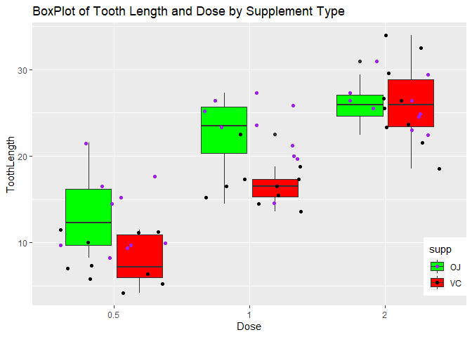

    library(statsr)
    library(ggplot2)

    data("ToothGrowth")

    unique(ToothGrowth$dose)

    ## [1] 0.5 1.0 2.0

    str(ToothGrowth)

    ## 'data.frame':    60 obs. of  3 variables:
    ##  $ len : num  4.2 11.5 7.3 5.8 6.4 10 11.2 11.2 5.2 7 ...
    ##  $ supp: Factor w/ 2 levels "OJ","VC": 2 2 2 2 2 2 2 2 2 2 ...
    ##  $ dose: num  0.5 0.5 0.5 0.5 0.5 0.5 0.5 0.5 0.5 0.5 ...

    ?ToothGrowth

    ## starting httpd help server ... done

    ToothGrowth$dose <- as.factor(ToothGrowth$dose)

    # Question Of Interest 
    print("is Dose Level affected taken affecting the result ? ")

    ## [1] "is Dose Level affected taken affecting the result ? "

    print("is there a correlation between Tooth Length supplement type by the dose level ?")

    ## [1] "is there a correlation between Tooth Length supplement type by the dose level ?"

    print("which is better for tooth length growth?")

    ## [1] "which is better for tooth length growth?"

    # Summary Statistics 
    summary(ToothGrowth$len)

    ##    Min. 1st Qu.  Median    Mean 3rd Qu.    Max. 
    ##    4.20   13.07   19.25   18.81   25.27   33.90

    summary(ToothGrowth$supp)

    ## OJ VC 
    ## 30 30

    summary(ToothGrowth$dose)

    ## 0.5   1   2 
    ##  20  20  20

    table(ToothGrowth$supp ,ToothGrowth$dose)

    ##     
    ##      0.5  1  2
    ##   OJ  10 10 10
    ##   VC  10 10 10

Explanatory Data Analysis
=========================

Let’s See What we have here

    # Checking the Supplement Type
    set.seed(4)
    ggplot2::ggplot(data = ToothGrowth , aes(x = dose , y = len )) + 
            ggplot2::geom_boxplot(aes(fill = supp))+
            ggplot2::geom_point(aes(color=supp) , position = "jitter") + # because the dose is not always exact same , 
            ggplot2::scale_color_manual(values = c("purple","black")) + 
            ggplot2::scale_fill_manual(values = c("green","red")) +
            ggplot2::theme(legend.position=c(1,0.2),legend.justification=c(1,0.8)) +
            ggplot2::labs(title = "BoxPlot of Tooth Length and Dose by Supplement Type", y = "ToothLength", x ="Dose")

Let’s do Inference print(“is there a correlation between Tooth Length
and supplement type ?”)

    t.test(formula = len ~ supp , data = ToothGrowth , paired = FALSE , var.equal = F )

    ## 
    ##  Welch Two Sample t-test
    ## 
    ## data:  len by supp
    ## t = 1.9153, df = 55.309, p-value = 0.06063
    ## alternative hypothesis: true difference in means is not equal to 0
    ## 95 percent confidence interval:
    ##  -0.1710156  7.5710156
    ## sample estimates:
    ## mean in group OJ mean in group VC 
    ##         20.66333         16.96333

Because Our Null Hypothesis is 0 and our p\_value is &gt; 0.05 and the
confidence interval contain the 0 , thus we can say there is no
correlation between the supplement type,but is that true ? .

Let’s do another Inference print(“is there a correlation between Tooth
Length and Supplement type based on dose level ?”)

    ToothGrowth$dose

    ##  [1] 0.5 0.5 0.5 0.5 0.5 0.5 0.5 0.5 0.5 0.5 1   1   1   1   1   1   1   1   1  
    ## [20] 1   2   2   2   2   2   2   2   2   2   2   0.5 0.5 0.5 0.5 0.5 0.5 0.5 0.5
    ## [39] 0.5 0.5 1   1   1   1   1   1   1   1   1   1   2   2   2   2   2   2   2  
    ## [58] 2   2   2  
    ## Levels: 0.5 1 2

    doselevel05 <-ToothGrowth[ToothGrowth$dose == "0.5",]
    doselevel2 <-ToothGrowth[ToothGrowth$dose == "2",]
    doselevel1  <-ToothGrowth[ToothGrowth$dose == "1",]
    t.test(formula = len ~ supp , data = doselevel05 , paired = F , var.equal = F)

    ## 
    ##  Welch Two Sample t-test
    ## 
    ## data:  len by supp
    ## t = 3.1697, df = 14.969, p-value = 0.006359
    ## alternative hypothesis: true difference in means is not equal to 0
    ## 95 percent confidence interval:
    ##  1.719057 8.780943
    ## sample estimates:
    ## mean in group OJ mean in group VC 
    ##            13.23             7.98

Wait the confidence interval does not contain 0 , which mean there is a
correlation here between supplement type and tooth length , so i guess
the Dose taken seems to affect the tooth length

    t.test(formula = len ~ supp , data = doselevel1 , paired = F , var.equal = F)

    ## 
    ##  Welch Two Sample t-test
    ## 
    ## data:  len by supp
    ## t = 4.0328, df = 15.358, p-value = 0.001038
    ## alternative hypothesis: true difference in means is not equal to 0
    ## 95 percent confidence interval:
    ##  2.802148 9.057852
    ## sample estimates:
    ## mean in group OJ mean in group VC 
    ##            22.70            16.77

Wait the confidence interval does not contain 0 , which mean there is a
correlation here between supplement type and tooth length ,it could be
affect the length of Tooth , so i guess the Dose taken seems to affect
the tooth length

    t.test(formula = len ~ supp , data = doselevel2 , paired = F , var.equal = F) 

    ## 
    ##  Welch Two Sample t-test
    ## 
    ## data:  len by supp
    ## t = -0.046136, df = 14.04, p-value = 0.9639
    ## alternative hypothesis: true difference in means is not equal to 0
    ## 95 percent confidence interval:
    ##  -3.79807  3.63807
    ## sample estimates:
    ## mean in group OJ mean in group VC 
    ##            26.06            26.14

Ahh We Found it , seems this guy here doesnt correlated the tooth length
,for given people with high Dose level

Assumptions Needed For The Conclusions:
---------------------------------------

-   Members of the sample population, the 60 guinea pigs, are
    representative of the entire population of guinea pigs. This
    assumption Satisfied The Random Sample.
-   For Each P and (p-1) is exactly &gt;= 10 are satisfied to

For the t-tests, the variances are assumed to be different for the two
groups being compared. This assumption is less stronger than the case in
which the variances are assumed to be equal.

\# Conclusion
-------------

-   is Dose Level affected taken affecting the result ? Yes, Increase in
    supplement Dose levels leads to overall increase in Tooth length on
    average.

-is there a correlation between Tooth Length supplement type by the dose
level ? Yes ,Supplement method has no significant impact on Tooth length
for doseLevel 2 ,but for doselevel 0.5 and 1 it seems there are a
significant impact.

-"which is better for tooth length growth?Orange Juice increase a tooth
length growth more fast compare the ascorbic acid
