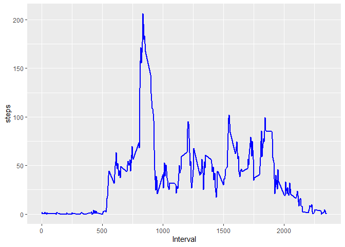
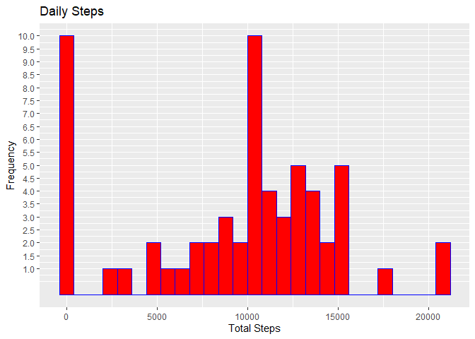
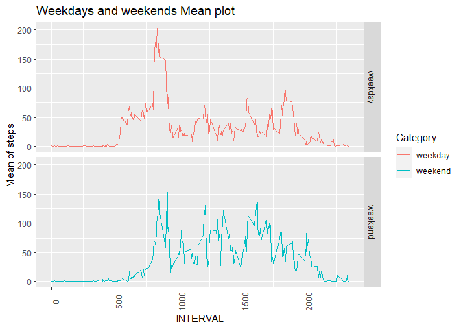

Introduction :
--------------

It is now possible to collect a large amount of data about personal
movement using activity monitoring devices such as a Fitbit, Nike
Fuelband, or Jawbone Up. These type of devices are part of the
“quantified self” movement – a group of enthusiasts who take
measurements about themselves regularly to improve their health, to find
patterns in their behavior, or because they are tech geeks. But these
data remain under-utilized both because the raw data are hard to obtain
and there is a lack of statistical methods and software for processing
and interpreting the data.

This assignment makes use of data from a personal activity monitoring
device. This device collects data at 5 minute intervals through out the
day. The data consists of two months of data from an anonymous
individual collected during the months of October and November, 2012 and
include the number of steps taken in 5 minute intervals each day.

The data for this assignment can be downloaded from the course web site:

-   Dataset: [Activity monitoring
    data](https://d396qusza40orc.cloudfront.net/repdata%2Fdata%2Factivity.zip)

The variables included in this dataset are:

steps: Number of steps taking in a 5-minute interval (missing values are
coded as 𝙽𝙰)   date: The date on which the measurement was taken in
YYYY-MM-DD format   interval: Identifier for the 5-minute interval
in which measurement was taken   The dataset is stored in a
comma-separated-value (CSV) file and there are a total of 17,568
observations in this dataset.

Processing DATA
---------------

Make sure you change the working directory

    setwd("D:/Reproducible Research/Week2")

Let’s Read & load The data then Check The summary

    activitydf <- read.csv("./DataSet/repdata_data_activity/activity.csv")
    # Change Date to it's type
    activitydf$date <- strptime(x = activitydf$date ,format = "%Y-%m-%d" )

    print(cat("Step Null :" , sum(is.na(activitydf$steps)),
              "\nDate Null :" , sum(is.na(activitydf$date)),
              "\nInterval Null : ",sum(is.na(activitydf$interval))))

    ## Step Null : 2304 
    ## Date Null : 0 
    ## Interval Null :  0NULL

    str(activitydf)

    ## 'data.frame':    17568 obs. of  3 variables:
    ##  $ steps   : int  NA NA NA NA NA NA NA NA NA NA ...
    ##  $ date    : POSIXlt, format: "2012-10-01" "2012-10-01" ...
    ##  $ interval: int  0 5 10 15 20 25 30 35 40 45 ...

Because there’s N.A values , we’ll remove it for now ,since we want to
get sense of data.

    CleanDf <- subset(activitydf , is.na(activitydf$steps) != T)

    print(cat("Step Null :" , sum(is.na(CleanDf$steps)),
              "\nDate Null :" , sum(is.na(CleanDf$date)),
              "\nInterval Null : ",sum(is.na(CleanDf$interval))))

    ## Step Null : 0 
    ## Date Null : 0 
    ## Interval Null :  0NULL

    str(activitydf)

    ## 'data.frame':    17568 obs. of  3 variables:
    ##  $ steps   : int  NA NA NA NA NA NA NA NA NA NA ...
    ##  $ date    : POSIXlt, format: "2012-10-01" "2012-10-01" ...
    ##  $ interval: int  0 5 10 15 20 25 30 35 40 45 ...

What is the total number of steps taken each day ?
--------------------------------------------------

let’s Build Histogram for total number of steps taken each day using the
Clean Dataset

    # We're Aggregating the step using Sum function 
    TotalStepstaken <- aggregate(x = CleanDf$steps , by = list(as.Date(CleanDf$date)) , FUN = sum)
    names(TotalStepstaken) <- c("date", "total")

    library(ggplot2)
    ggplot2::ggplot( data = TotalStepstaken , aes(x = total))+
            ggplot2::geom_histogram(binwidth = 800 , fill = "green" ,col ="blue") +
            ggplot2::labs(x = "Steps per day" , y = "Frequency" , title = "Daily Steps") +
            ggplot2::scale_y_continuous(breaks = seq(1,10 ,by =0.5))

 We can
that per each day there’s alot steps per day ,we can say that roughly
10000 - 11000 steps each day. What about the mean ? Let’s Check it out

    with(TotalStepstaken , {
            mean_steps = mean(total ,na.rm = T)
            Median_steps = median(total , na.rm = T)
            cat(paste("Mean : " , mean_steps , 
                      "\nMedian : " , Median_steps))}
    )

    ## Mean :  10766.1886792453 
    ## Median :  10765

Just like what i thought before :D .

\#\#What is the average daily activity interval ?

So Now ,we’re going to to doing aggregate again

    AverageSteptaken <- aggregate(x = CleanDf$steps , by = list(CleanDf$interval) ,
                                  FUN = mean)
    names(AverageSteptaken) <- c("Interval" , "steps" )
    ggplot2::ggplot(data = AverageSteptaken , 
                    aes(x =Interval, y = steps)) +
            ggplot2::geom_line(size = 1 ,col = "blue" )

 We can
see that ,its going up very between 700 and 850 i guess.Then drop down
and it’s unstable again. It’s worth to know what cause the high steps on
that interval,but we’re not going to do dat. But here’s the Max average
steps on interval x.

    AverageSteptaken[AverageSteptaken$steps == max(AverageSteptaken$steps), "Interval"]

    ## [1] 835

Working with Missing Values
---------------------------

So now we’re working with missing values . We Can Use Median / Mean Tho
no need to be sophiscated right now. But We will use median , because
the data skewed.

    activitydf[is.na(activitydf$steps) == T ,"steps"] <- median(activitydf$steps,na.rm =T)

    # Let's Check The Previous Histogram with imputed missing values
    TotalStepstaken <- stats::aggregate(x = activitydf$steps , by = list(as.Date(activitydf$date)),
                                        FUN = sum)
    names(TotalStepstaken) <- c("date" , "total")
    ggplot2::ggplot(data = TotalStepstaken , 
                    aes(x = total)) + 
            geom_histogram(binwidth = 800 , col = "blue" , fill = "red") +
            labs( title = "Daily Steps", x = "Total Steps" , y = "Frequency" ) +
            ggplot2::scale_y_continuous(breaks = seq(1,10 ,by =0.5))

 Course
there’s 0 changed,because the median is also 0.

Now We will compare the weekEnd And Weekdays , doing god’s work now .
---------------------------------------------------------------------

    weekday <- base::weekdays(x = activitydf$date)
    unique(weekday)

    ## [1] "Monday"    "Tuesday"   "Wednesday" "Thursday"  "Friday"    "Saturday" 
    ## [7] "Sunday"

    activitydf[grepl(pattern = "Monday|Tuesday|Wednesday|Thursday|Friday|" , x = weekday) , 'Weekdays'] <- "weekday"
    activitydf[grepl(pattern = "Saturday|Sunday", x = weekday) , 'Weekend'] <- "weekend"
    activitydf$WeekDaysOrEnd <- paste(activitydf$Weekdays,activitydf$Weekend)
    activitydf$WeekDaysOrEnd[activitydf$WeekDaysOrEnd == "weekday NA"] <- "weekday"
    activitydf$WeekDaysOrEnd[activitydf$WeekDaysOrEnd == "weekday weekend"] <- "weekend"
    activitydf <- activitydf[, c(1,2,3,6)]
    activitydf$day <- weekday

    str(activitydf)

    ## 'data.frame':    17568 obs. of  5 variables:
    ##  $ steps        : num  0 0 0 0 0 0 0 0 0 0 ...
    ##  $ date         : POSIXlt, format: "2012-10-01" "2012-10-01" ...
    ##  $ interval     : int  0 5 10 15 20 25 30 35 40 45 ...
    ##  $ WeekDaysOrEnd: chr  "weekday" "weekday" "weekday" "weekday" ...
    ##  $ day          : chr  "Monday" "Monday" "Monday" "Monday" ...

Now we will build the plots

    AverageDaysEnd <- aggregate(x = activitydf$steps , 
                                by = list(activitydf$interval , activitydf$WeekDaysOrEnd),
                                FUN = mean)
    names(AverageDaysEnd) <- c("interval","weekEndORDays","meanStep")
    ggplot2::ggplot(data = AverageDaysEnd , aes(x = interval , y = meanStep ,col= weekEndORDays ))+
            geom_line() + 
            facet_grid(weekEndORDays ~ .) + 
            labs(x = "INTERVAL" , y ="Mean of steps" ,title = "Weekdays and weekends Mean plot") +
            guides(col = guide_legend(title = "Category")) +
            theme(axis.text.x = element_text(angle = 90))

 As
you can see there’s something weirdos on weekday plot that outlier
,while weekend seems normal .
