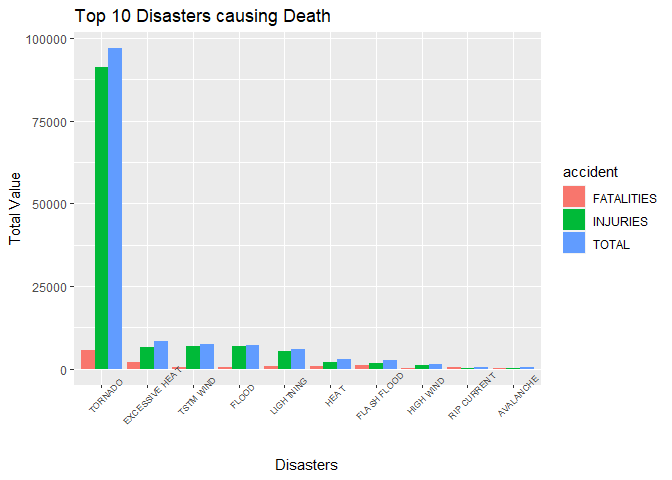
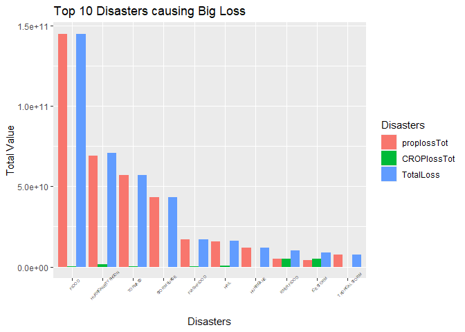

Introduction :
--------------

The goal of the assignment is to explore the NOAA Storm Database and
explore the effects of severe weather events on both population and
economy.The database covers the time period between 1950 and November
2011.

The following analysis investigates which types of severe Disasters are
most harmful on:

Health (injuries and fatalities) Property and crops (economic
consequences) \#\# My Software Environment

    sessionInfo()

    ## R version 4.0.1 (2020-06-06)
    ## Platform: x86_64-w64-mingw32/x64 (64-bit)
    ## Running under: Windows 10 x64 (build 18363)
    ## 
    ## Matrix products: default
    ## 
    ## locale:
    ## [1] LC_COLLATE=English_Indonesia.1252  LC_CTYPE=English_Indonesia.1252   
    ## [3] LC_MONETARY=English_Indonesia.1252 LC_NUMERIC=C                      
    ## [5] LC_TIME=English_Indonesia.1252    
    ## 
    ## attached base packages:
    ## [1] stats     graphics  grDevices utils     datasets  methods   base     
    ## 
    ## loaded via a namespace (and not attached):
    ##  [1] compiler_4.0.1  magrittr_1.5    tools_4.0.1     htmltools_0.4.0
    ##  [5] yaml_2.2.1      Rcpp_1.0.4.6    stringi_1.4.6   rmarkdown_2.2  
    ##  [9] knitr_1.28      stringr_1.4.0   xfun_0.14       digest_0.6.25  
    ## [13] rlang_0.4.6     evaluate_0.14

Data Processing
---------------

### Loading & reading data

    library(dplyr)

    ## 
    ## Attaching package: 'dplyr'

    ## The following objects are masked from 'package:stats':
    ## 
    ##     filter, lag

    ## The following objects are masked from 'package:base':
    ## 
    ##     intersect, setdiff, setequal, union

    library(plyr)

    ## Warning: package 'plyr' was built under R version 4.0.2

    ## ------------------------------------------------------------------------------

    ## You have loaded plyr after dplyr - this is likely to cause problems.
    ## If you need functions from both plyr and dplyr, please load plyr first, then dplyr:
    ## library(plyr); library(dplyr)

    ## ------------------------------------------------------------------------------

    ## 
    ## Attaching package: 'plyr'

    ## The following objects are masked from 'package:dplyr':
    ## 
    ##     arrange, count, desc, failwith, id, mutate, rename, summarise,
    ##     summarize

    library(ggplot2) 
    library(reshape2) 

    ## Warning: package 'reshape2' was built under R version 4.0.2

    setwd("D:/Reproducible Research/Week4")
    #fileurl <- "https://d396qusza40orc.cloudfront.net/repdata%2Fdata%2FStormData.csv.bz2"
    #download.file(url = fileurl , destfile = "DataSet/repdata_data_StormData.csv")

    stromdf <- read.csv("./DataSet/repdata_data_StormData.csv/repdata_data_StormData.csv")
    stromdf <- stromdf[,c("EVTYPE" , "FATALITIES","INJURIES","PROPDMG","PROPDMGEXP","CROPDMG","CROPDMGEXP")]

### Subsetting & Preprocessing Data

This is important because there’s alot things to be done , data is messy

    TotalGrouped <- subset(stromdf , EVTYPE != '?' & (FATALITIES > 0 | INJURIES > 0 | PROPDMG > 0 | CROPDMG > 0))

    TotalGrouped$PROPDMGEXP <- toupper(TotalGrouped$PROPDMGEXP)
    TotalGrouped$CROPDMGEXP <- toupper(TotalGrouped$CROPDMGEXP)
    ## Convert the Exponent Variables
    Propdmgconv <- c("-" = 10^0, "+" = 10^0,
                     "H" = 10^2, "K" = 10^3,
                     "M" = 10^6, "B" = 10^9,
                     "0" = 10^0, "1" = 10^1,
                     "2" = 10^2, "3" = 10^3,
                     "4" = 10^4, "5" = 10^5,
                     "6" = 10^6, "7" = 10^7,
                     "8" = 10^8 ,"9" = 10^9)
    Cropdmgconv <- c( 
                     "?" = 10^0,"0" = 10^0,
                     "K" = 10^3,"M" = 10^4,
                     "B" = 10^9) 
    TotalGrouped$PROPDMGEXP[TotalGrouped$PROPDMGEXP == ""] <- 10^0
    TotalGrouped$CROPDMGEXP[TotalGrouped$CROPDMGEXP == ""] <- 10^0

    TotalGrouped$PROPDMGEXP <- revalue(TotalGrouped$PROPDMGEXP , Propdmgconv)

    ## The following `from` values were not present in `x`: 8, 9

    TotalGrouped$CROPDMGEXP <- revalue(TotalGrouped$CROPDMGEXP , Cropdmgconv)

### Calculate Total Fatalities and Injuries then Melt the top10

    TotalGrouped %>% 
            dplyr::group_by(EVTYPE) %>%
            dplyr::summarise(FATALITIES = sum(FATALITIES),INJURIES = sum(INJURIES),
                             TOTAL = sum(FATALITIES) + sum(INJURIES)) -> Totalaccident

    ## `summarise()` ungrouping output (override with `.groups` argument)

    Totalaccident <- Totalaccident[order(-Totalaccident$FATALITIES),] # Sorting Values
    Top10 <- head(Totalaccident , n =10)
    Top10 <- reshape2::melt(data = Top10 , id.vars = c("EVTYPE") ,variable.name = "accident")

### Plot The top 10 Dangerous Disasters

    ggplot2::ggplot(data = Top10, aes(x = reorder(EVTYPE, -value) , y = value , fill = accident)) +
            ggplot2::geom_bar(stat = "identity" , position = 'dodge') +
            ggplot2::labs(x = "Disasters" , y = "Total Value" , title = "Top 10 Disasters causing Death") +
            ggplot2::theme(axis.text.x = element_text(angle = 45 ,size = 7)) 

 So
From here we know that tornado make people get injuried the most,compare
others.

### Economic Consiquencies

### Calculate Total Prop & Crop Loss Then Melt it.

    OverallLoss <- TotalGrouped

    OverallLoss$proploss <- OverallLoss$PROPDMG * as.numeric(OverallLoss$PROPDMGEXP)
    OverallLoss$croploss <- OverallLoss$CROPDMG * as.numeric(OverallLoss$CROPDMGEXP)

    OverallLoss %>% 
            dplyr::group_by(EVTYPE) %>%
            dplyr::summarise(proplossTot = sum(proploss) ,
                      CROPlossTot = sum(croploss) , 
                      TotalLoss = sum(proplossTot) + sum(CROPlossTot))  -> OverallLoss

    ## `summarise()` ungrouping output (override with `.groups` argument)

    OverallLoss <- OverallLoss[order(-OverallLoss$TotalLoss) , ] 
    Top10Loss <- head(OverallLoss , 10)
    Top10Loss <-reshape2::melt(data = Top10Loss , id.vars = c('EVTYPE'),variable.name = "Disasters")

### Plot The Top 10 Dangerous Disasters for Economic

    ggplot2::ggplot(data = Top10Loss , aes(x = reorder(EVTYPE , -value) , y =value ,fill = Disasters )) +
            ggplot2::geom_bar(stat = "identity" , position = "dodge" ,) + 
            ggplot2::labs(x = "Disasters" , y = "Total Value" , title = "Top 10 Disasters causing Big Loss")+
            ggplot2::theme(axis.text.x = element_text(angle = 45 , size = 4))

